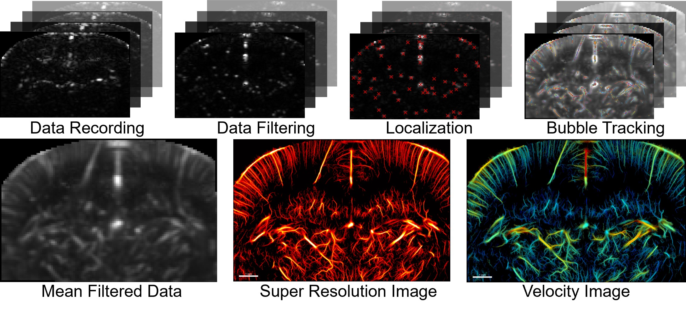
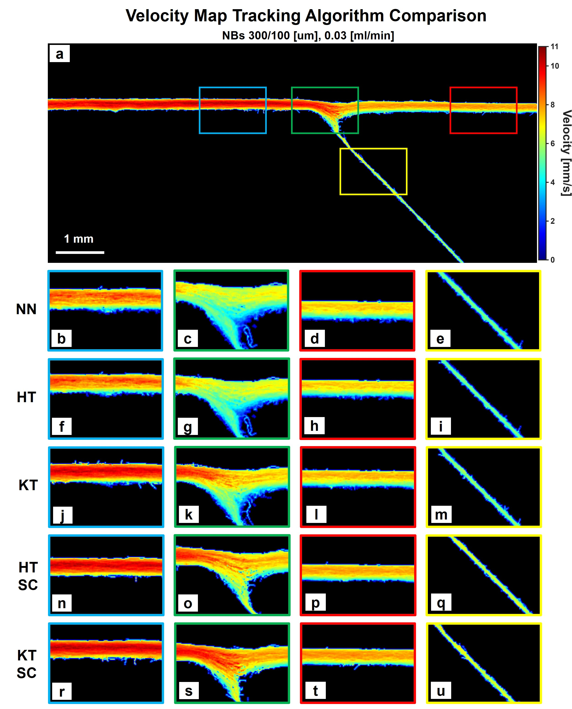
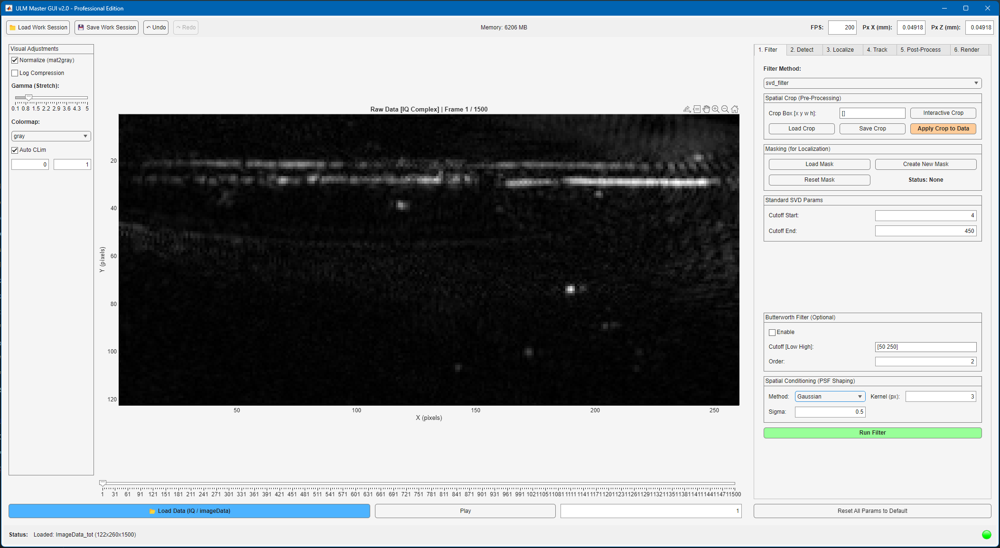
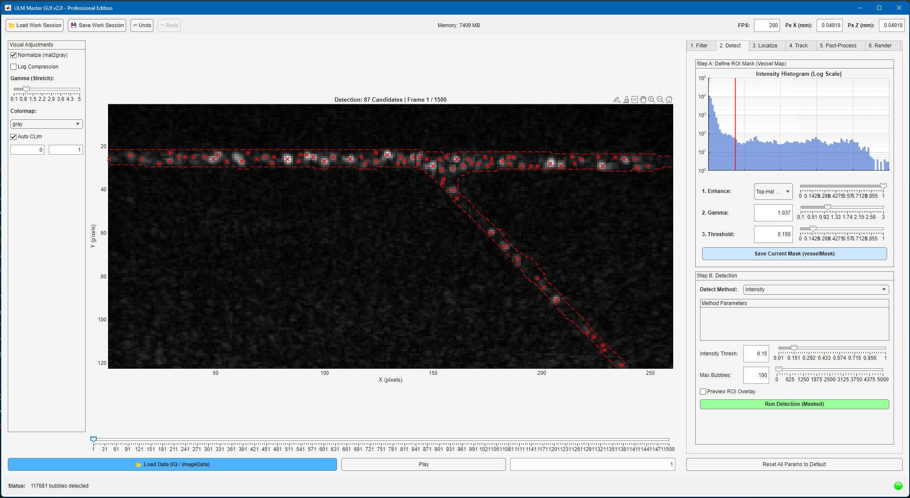
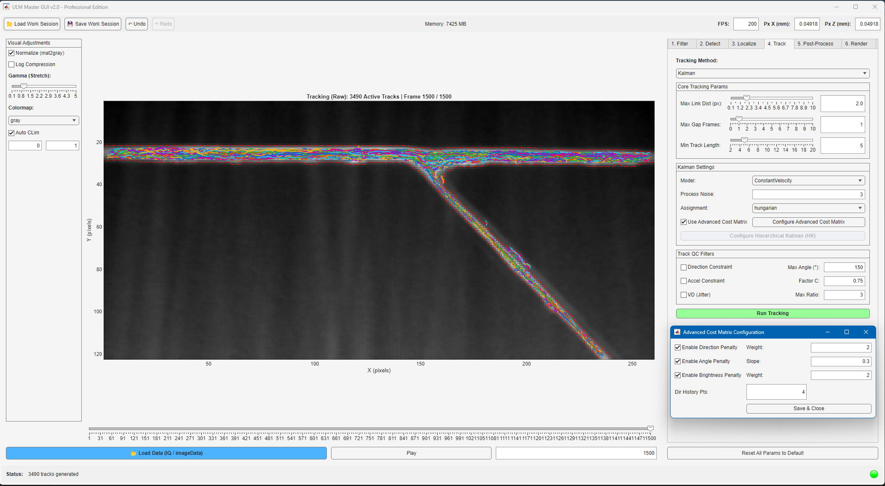
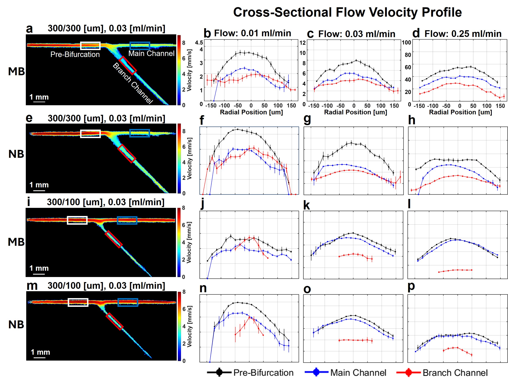
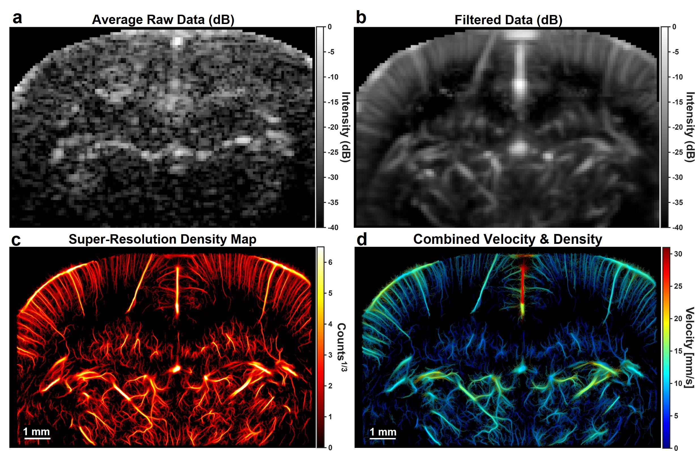

# ULM Super-Resolution Toolbox
### A MATLAB Framework for Ultrasound Localization Microscopy with Micro- and Nanobubbles

[](https://www.mathworks.com/)
[](LICENSE)
[]()

---

## 👤 Authors & Affiliation

**Grigori Shapiro**  
Tali Ilovitsh Lab  
School of Biomedical Engineering  
Tel Aviv University, Tel Aviv, Israel

**Supervisor:** Prof. Tali Ilovitsh

---

## 📄 Citation

If you use this toolbox in your research, please cite:

**Thesis:**
> Shapiro, G. "Ultrasound Localization Microscopy with Micro- and Nanobubbles: Processing Framework and Experimental Validation." M.Sc. Thesis, School of Biomedical Engineering, Tel Aviv University, March 2026.

**Journal Article** *(in preparation — citation will be updated upon publication):*
> Shapiro, G., et al. "[Title TBD]." *[Journal TBD]*, [Year TBD].
> DOI: *pending*

---

## 📋 Table of Contents

1. [Overview](#1-overview)
2. [Scientific Background](#2-scientific-background)
3. [Key Features](#3-key-features)
4. [System Requirements](#4-system-requirements)
5. [Installation](#5-installation)
6. [Repository Structure](#6-repository-structure)
7. [Quick Start](#7-quick-start)
8. [Input Data Format](#8-input-data-format)
9. [Configuration — setDefaultParams](#9-configuration--setdefaultparams)
10. [Processing Pipeline](#10-processing-pipeline)
    - [Stage 1: Clutter Filtering](#stage-1-clutter-filtering)
    - [Stage 2: Bubble Detection](#stage-2-bubble-detection)
    - [Stage 3: Sub-Pixel Localization](#stage-3-sub-pixel-localization)
    - [Stage 4: Tracking](#stage-4-tracking)
    - [Stage 5: Post-Processing & Rendering](#stage-5-post-processing--rendering)
11. [The ULM Master GUI](#11-the-ulm-master-gui)
12. [Batch Scripts](#12-batch-scripts)
13. [Output Files](#13-output-files)
14. [Quantitative Metrics](#14-quantitative-metrics)
15. [Validation Datasets](#15-validation-datasets)
16. [Reproducing Paper Results](#16-reproducing-paper-results)
17. [Acknowledgments](#17-acknowledgments)
18. [License](#18-license)

---

## 1. Overview

This repository provides a complete, modular MATLAB toolbox for **Ultrasound Localization Microscopy (ULM)** — a super-resolution imaging technique that resolves microvascular architecture beyond the acoustic diffraction limit by localizing and tracking individual contrast agents (microbubbles or nanobubbles) across thousands of image frames.

The toolbox was developed as part of a research programme investigating **sub-micron nanobubbles (NB)** as a novel ULM contrast agent and comparing their hemodynamic performance against standard microbubbles (MB). A central contribution is the development of the **ULM Master GUI**, an interactive optimization platform designed specifically to address the sensitivity demands of nanobubble imaging — agents whose acoustic cross-section is several orders of magnitude weaker than MB and whose signals can be buried in noise and tissue clutter.

The framework supports the complete pipeline from raw IQ ultrasound data to publication-quality super-resolution maps, and has been validated on:
- In vitro gelatin phantoms (100–500 μm wall-less channels)
- In vivo rat brain data (benchmark dataset)
- In vivo rat kidney data

<p align="center">
  
  <br>
  <em>The main steps in ULM: from raw IQ data recording through clutter filtering and bubble detection, to sub-pixel localization, trajectory tracking, and final super-resolution density and velocity maps. Processing shown was performed on an in vivo rat brain dataset (Chavignon et al., Zenodo 2023).</em>
</p>

---

## 2. Scientific Background

ULM overcomes the diffraction limit by treating imaging as a **localization problem** rather than a resolution problem. The center of an isolated point spread function (PSF) can be localized with a precision σ_loc significantly higher than the PSF width:

```
σ_loc ∝ FWHM / √SNR
```

By injecting a dilute suspension of gas-filled contrast agents and imaging at high frame rates (200–1000 Hz), individual agent PSFs are spatially separated in each frame. Their sub-pixel centroids are accumulated over thousands of frames to reconstruct a high-density map of the microvasculature with resolution an order of magnitude beyond the diffraction limit.

**Why nanobubbles?** Standard microbubbles (1–10 μm) are restricted to vessels larger than their own diameter and cannot extravasate. Sub-micron nanobubbles (100–800 nm) can perfuse the finest capillary networks and reach tissues inaccessible to MB. However, their scattering cross-section follows a sixth-power diameter dependence (Rayleigh regime):

```
σ_s ∝ r⁶ / λ⁴
```

A 10× reduction in diameter yields a theoretical 60 dB signal reduction — making sensitive, adaptively-optimized processing essential for NB-ULM. This toolbox provides that processing infrastructure.

---

## 3. Key Features

### Processing Engine
- **4 clutter filtering algorithms:** Standard SVD, SVD-SSM, DCC-SVD (automated clustering), and block-wise adaptive SVD
- **3 detection methods:** Intensity thresholding, Neyman-Pearson hypothesis test, Normalized Cross-Correlation template matching
- **3 sub-pixel localization algorithms:** Gradient-based radial symmetry, 2D Gaussian NLLS fitting, vectorized fast Gaussian fitting
- **4 tracking algorithms:** Nearest Neighbor, Hungarian, Standard Kalman, Hierarchical Kalman (HKT)
- **Smart Cost Matrix (SCM):** Incorporates directional persistence and brightness consistency penalties
- **Multi-level quality control** at detection, localization, and track levels

### Interactive GUI
- Real-time parameter optimization with instant visual feedback
- Cached SVD decomposition — slider adjustments are instantaneous after the first run
- Session save/load for complete workspace reproducibility
- 20-level undo/redo system
- Integrated masking and ROI tools with CLAHE, Top-Hat, and Sharpen enhancement

### In Vivo Preprocessing
- Automated respiratory phase detection and frame rejection (Pan-Tompkins inspired)
- Two-stage motion correction: rigid registration per cardiac cycle + inter-cycle drift correction
- Optional non-rigid B-spline refinement for soft-tissue deformation

### Outputs
- Bubble density maps (power-law compressed)
- Raw and Gaussian-smoothed velocity maps
- HSV dual-mode fusion maps (velocity + density)
- Quantitative track metrics (tortuosity, track length, velocity distributions)
- Publication-ready PNG and MATLAB `.fig` exports

---

## 4. System Requirements

### MATLAB Version
| Version | Status |
|---------|--------|
| R2022a or later | Recommended |
| R2020b – R2021b | Supported |
| Earlier than R2020b | Not supported |

### Required Toolboxes
| Toolbox | Used For |
|---------|----------|
| Image Processing Toolbox | Masking, morphological operations, ROI tools |
| Signal Processing Toolbox | Butterworth filter, Savitzky-Golay smoothing |
| Statistics and Machine Learning Toolbox | K-means clustering in DCC-SVD |
| Optimization Toolbox | Gaussian fitting (`lsqcurvefit`) |

### Optional Toolboxes
| Toolbox | Benefit |
|---------|---------|
| Parallel Computing Toolbox | Significant speedup for Gaussian fitting and post-processing via `parfor` |

### Hardware
- **RAM:** 16 GB minimum; 32 GB+ recommended for in vivo datasets
- **Storage:** ~1–5 GB per experimental dataset; session files up to 2 GB
- **Display:** 1920×1080 minimum (GUI designed for 1600×1000 px)

### Operating Systems
- Windows 10/11 (primary development platform)
- macOS (tested)
- Linux (tested)

---

## 5. Installation

### Step 1 — Clone the Repository
```bash
git clone https://github.com/YOUR_USERNAME/ulm-super-resolution-toolbox.git
cd ulm-super-resolution-toolbox
```

### Step 2 — Add to MATLAB Path
The example scripts handle this automatically. For manual setup:
```matlab
addpath(genpath('/path/to/ulm-super-resolution-toolbox'));
```

### Step 3 — Verify Toolboxes
```matlab
ver   % Check installed toolboxes match the requirements above
```

### Step 4 — Test the Installation
```matlab
% Launch the GUI — if this opens without errors, installation is complete
ULM_Master_GUI_v2
```

---

## 6. Repository Structure

```
ulm-super-resolution-toolbox/
│
├── README.md                          ← This file
├── README_GUI.md                      ← Detailed GUI documentation
├── LICENSE
├── CITATION.cff
│
├── GUI/                               ← Interactive optimization platform
│   ├── ULM_Master_GUI_v2.m            ← Main GUI entry point
│   ├── ULM_Constants.m                ← Centralized defaults and limits
│   ├── SessionManager.m               ← Session save/load
│   ├── UndoRedoManager.m              ← Parameter history (20 levels)
│   ├── DisplayManager.m               ← All visualization logic
│   └── DataHash.m                     ← SVD cache invalidation
│
├── core/                              ← Processing algorithms
│   │
│   ├── ULM_Processor.m                ← Main processing class (state machine)
│   │
│   ├── detection/
│   │   ├── detectBubbles.m            ← Intensity-based regional maxima
│   │   ├── detectBubbles_NCC.m        ← Normalized cross-correlation
│   │   └── detectBubbles_NP.m        ← Neyman-Pearson hypothesis test
│   │
│   ├── localization/
│   │   ├── localizeRadialSymmetry.m   ← Gradient-based radial symmetry
│   │   ├── fit2DGaussian.m            ← Full 2D Gaussian NLLS fit
│   │   └── fit2DGaussian_Fast.m       ← Vectorized Gaussian fitting
│   │
│   ├── tracking/
│   │   ├── trackNearestNeighbor.m     ← Greedy NN linker
│   │   ├── trackHungarian.m           ← Global Hungarian assignment
│   │   ├── trackKalman.m              ← Standard Kalman filter tracker
│   │   ├── trackKalman_Advanced.m     ← Hierarchical Kalman tracker (HKT)
│   │   ├── calculateCostMatrix.m      ← Smart Cost Matrix (SCM) engine
│   │   └── munkres.m                  ← Munkres/Hungarian solver
│   │
│   ├── filtering/
│   │   ├── SVD_filter.m               ← Standard SVD clutter filter
│   │   ├── SVD_SSM.m                  ← Spatial Similarity Matrix method
│   │   ├── SVD_blockwise.m            ← Block-wise adaptive SVD
│   │   ├── DCC_SVD.m                  ← Density Canopy Clustering SVD
│   │   ├── run_SVD_Decomposition.m    ← SVD decomposition runner
│   │   ├── reconstruct_SVD_Signal.m   ← Signal reconstruction from SVD
│   │   └── Butterworth_bandpass_filter.m ← Temporal bandpass filter
│   │
│   └── rendering/
│       ├── renderHistogram.m          ← Histogram accumulation (default)
│       └── renderGaussian.m           ← Gaussian-blurred density map
│
├── config/
│   ├── setDefaultParams.m             ← All experiment parameters
│   └── getExpParams.m                 ← Parses info.txt metadata file
│
├── utils/
│   ├── applyQualityControl.m          ← Master QC dispatcher
│   ├── applyAccelerationConstraint.m  ← Velocity-change gating
│   ├── applyDirectionConstraint.m     ← Direction-change gating
│   ├── applyVDConstraint.m            ← Velocity dispersion (tortuosity) filter
│   ├── generateVesselMask.m           ← Algorithmic vessel mask generation
│   ├── printTrackMetrics.m            ← Console track statistics
│   └── analyze_ULM_Features.m        ← Feature extraction and quantification
│
└── examples/
    ├── run_ULM_Analysis.m             ← Standard batch pipeline (phantom/generic)
    ├── run_ULM_Analysis_Kidney.m      ← Full in vivo kidney pipeline
    ├── split_ImageData_tot_Kidney.m   ← Splits large superframes into batches
    ├── Bmode_video.m                  ← B-mode video export
    └── Kidney_video.m                 ← Kidney data video export
```

---

## 7. Quick Start

### Option A — Interactive (Recommended for New Datasets)

```matlab
% 1. Launch the GUI
ULM_Master_GUI_v2

% 2. Click "Load Raw Data (.mat)" and select your IQ data file
% 3. Work through the tabs: Filter → Detect → Localize → Track → Post-Process → Render
% 4. Save your session when done: "Save Work Session" in the menu bar
```

See [`README_GUI.md`](README_GUI.md) for the complete tab-by-tab guide with all parameters explained.

### Option B — Batch Processing (Phantom / Generic Data)

```matlab
% Edit config/setDefaultParams.m to set your data path and parameters
% Then run:
run_ULM_Analysis
```

### Option C — Batch Processing (In Vivo Kidney)

```matlab
% Edit config/setDefaultParams.m
% Then run:
run_ULM_Analysis_Kidney
```

---

## 8. Input Data Format

### Raw IQ Data
- **File type:** `.mat`
- **Variable:** Any 3D numeric array of shape `[Nz × Nx × Nt]`
  - `Nz` — axial pixels (image height)
  - `Nx` — lateral pixels (image width)
  - `Nt` — number of frames (time)
- The toolbox automatically detects the first 3D numeric array in the `.mat` file regardless of variable name.

### Metadata File (`info.txt`)
Each experiment folder must contain an `info.txt` file parsed by `getExpParams.m`. The file uses keyword-based syntax:

| Field | Example Line | Description |
|-------|-------------|-------------|
| Bubble type | `MBs` or `NBs` or `NanoDropletsC6` | Contrast agent type |
| Channel geometry | `300/100 [um]` | Main/secondary channel diameter |
| Frame rate | `FR: 200 Hz` | Acquisition frame rate |
| Flow rate | `Flow Rate: 0.03 ml/min` | Pump-programmed flow rate |
| Axial FOV | `FOV_Z: 14-20 mm` | Imaging depth range |
| Lateral FOV | `FOV_X: 12.7 mm` | Lateral field of view |
| Frequency | `f = 18 MHz` | Transducer center frequency |
| Angle | `45 [deg]` | Inflow angle |

If a field is missing, `getExpParams.m` returns `NaN` for that parameter and `setDefaultParams.m` will either auto-compute it or use a safe fallback — see Section 9.

### Folder Organization
```
ExperimentFolder/
├── info.txt               ← Metadata (required)
├── MBs/
│   └── Bmode/
│       ├── data_001.mat
│       ├── data_002.mat
│       └── ...
└── Results/               ← Auto-created by the pipeline
    ├── Mask.mat
    ├── cropBox.mat
    └── ...
```

---

## 9. Configuration — setDefaultParams

All experiment parameters are controlled from a single file: `config/setDefaultParams.m`. It is divided into two sections:

### QUICK EXPERIMENT SETTINGS
The top section — the only part most users ever need to edit:

```matlab
% --- Data path ---
% Leave '' to be prompted with a folder dialog, or hardcode your path:
user_data_folder = '';
% Example: user_data_folder = 'C:\Data\Experiment_01';

% --- Processing method choices ---
user_clutter_filter_method = 'svd_filter';  % 'svd_filter','svd_ssm','dcc_svd','svd_blockwise'
user_localization_method   = 'radial';       % 'radial','gaussian_fit','gaussian_fit_fast'
user_tracking_method       = 'Kalman';       % 'Kalman','Kalman_Advanced','Hungarian','nn'
user_rendering_method      = 'histogram';    % 'histogram','gaussian'

% --- Key tuning parameters ---
user_cutoff_svd                 = [4, 450];   % SVD singular value range [low, high]
user_detection_threshold        = 0.15;       % Bubble detection sensitivity (0–1)
user_max_bubbles_per_frame      = 100;        % Max candidate bubbles per frame
user_fwhm_pixels                = [3, 3];     % PSF size estimate [x, z] in pixels
                                              % Set to NaN to auto-compute from λ
user_max_linking_distance_px    = 2;          % Max frame-to-frame displacement (px)
                                              % Set to NaN to auto-compute from flow physics
user_channel_cross_section_mm2  = NaN;        % Channel area [mm²]
                                              % NaN = auto (rectangular, 0.3mm height × width)
```

### Auto-Compute vs. Manual Override
Parameters set to `NaN` are automatically computed from experiment physics by `calculateDerivedParams`:

| Parameter | Auto-compute Formula | When to Override |
|-----------|---------------------|-----------------|
| `max_linking_distance` | `ceil(v_max × dt / pixel_size)` | When auto-estimate is too permissive or restrictive |
| `fwhm` | `floor(λ / pixel_size) × 2 + 1` | Always recommended — fixed [3,3] is more stable |
| `channel_cross_section_mm2` | `width × 0.3 mm` (rectangular, fixed height) | Circular channels, non-standard geometry |

### Parameter Summary Print
At the end of every run, a structured summary is printed to the command window:

```
========================================================
  EXPERIMENT PARAMETER SUMMARY
========================================================

  DATA SOURCE
--------------------------------------------------------
  Data folder:                 C:\Data\Experiment_01
  Bubble type:                 MBs

  ACQUISITION
--------------------------------------------------------
  Frame rate:                  200 Hz
  Frequency:                   18 MHz
  Wavelength (lambda):         0.0856 mm  (85.6 um)

  SPATIAL CALIBRATION
--------------------------------------------------------
  Image size:                  [122 x 260] pixels  (Z x X)
  Pixel size Z:                0.0492 mm/px
  Pixel size X:                0.0490 mm/px

  FLOW & CHANNEL GEOMETRY
--------------------------------------------------------
  Flow rate:                   0.03 ml/min
  Main channel width:          300 um
  Channel cross-section:       0.09000 mm²

  DERIVED TRACKING VALUES
--------------------------------------------------------
  Max linking distance:        3 px
  FWHM [X, Z]:                 [3, 3] px
========================================================
```

---

## 10. Processing Pipeline

The ULM pipeline consists of five sequential stages, each implemented as a separate module in `core/`. The `ULM_Processor.m` class manages data flow between stages.

```
Raw IQ Data [Nz × Nx × Nt]
       │
       ▼
┌─────────────────┐
│  1. Filtering   │  Remove stationary tissue clutter
└────────┬────────┘
         │  Filtered IQ [Nz × Nx × Nt]
         ▼
┌─────────────────┐
│  2. Detection   │  Find candidate bubble locations (integer pixel)
└────────┬────────┘
         │  Candidate list [M × 2] per frame
         ▼
┌──────────────────┐
│  3. Localization │  Refine to sub-pixel precision + QC
└────────┬─────────┘
         │  Localization list [M' × 2] per frame
         ▼
┌─────────────────┐
│  4. Tracking    │  Link localizations into trajectories
└────────┬────────┘
         │  Track set {[Li × 4]} (position + velocity per point)
         ▼
┌──────────────────────────┐
│  5. Post-Process & Render│  Smooth, interpolate, project onto SR grid
└──────────────────────────┘
         │
         ▼
  Super-Resolution Maps (density, velocity, fusion)
```

---

### Stage 1: Clutter Filtering

**Goal:** Separate dynamic bubble signals from stationary/slow tissue background using the spatiotemporal structure of the data.

The raw IQ data `I(z, x, t)` is reshaped into a Casorati matrix `X ∈ C^{M×Nt}` (M = Nz×Nx) and decomposed:

```
X = UΣV*  =  Σᵢ σᵢ uᵢ vᵢ*
```

Tissue occupies the first few singular values (high energy, high temporal correlation). Bubble signals occupy intermediate indices. Electronic noise occupies high indices.

| Method | File | Description |
|--------|------|-------------|
| `svd_filter` | `SVD_filter.m` | Manual cutoff range `[low, high]`. SVD cached after first run — slider adjustments are instant. |
| `svd_ssm` | `SVD_SSM.m` | Spatial Similarity Matrix (Baranger et al., 2023). Calculates Pearson correlation between spatial singular vectors to identify tissue/blood boundary objectively. |
| `dcc_svd` | `DCC_SVD.m` | Density Canopy Clustering (Han et al., 2024). Each component characterized by 3D feature vector; K-means partitions into Tissue / Blood / Noise clusters. |
| `svd_blockwise` | `SVD_blockwise.m` | Divides image into overlapping spatial blocks and applies independent adaptive thresholding per block. Handles spatially non-uniform clutter. |

An optional **Butterworth bandpass filter** and **spatial convolution filter** (Gaussian, Median, DoG, Top-Hat) can be applied after SVD for additional refinement.

---

### Stage 2: Bubble Detection

**Goal:** Identify candidate bubble locations as regional intensity maxima above a noise floor.

| Method | File | Key Parameter |
|--------|------|---------------|
| `Intensity` | `detectBubbles.m` | Normalized threshold (0–1). Fast and robust — recommended default. |
| `NP` | `detectBubbles_NP.m` | Neyman-Pearson false alarm rate α₀ (e.g., 1e-4). Statistically rigorous. |
| `NCC` | `detectBubbles_NCC.m` | Normalized cross-correlation with a reference PSF template. Threshold = min correlation (e.g., 0.7). PSF can be Gaussian (analytical) or Experimental (loaded from `.mat`). |

> **Saturation check:** If the detected count per frame equals `max_bubbles_per_frame`, the detector is saturated and valid bubbles are being missed. Increase the limit.

---

### Stage 3: Sub-Pixel Localization

**Goal:** Refine integer-pixel detections to sub-pixel precision using the PSF geometry.

| Method | File | Description |
|--------|------|-------------|
| `radial` | `localizeRadialSymmetry.m` | Gradient-based radial symmetry (Parthasarathy, 2012). Non-iterative, fast. Weighted least-squares intersection of gradient lines. Weights ∝ ‖∇I‖². |
| `gaussian_fit` | `fit2DGaussian.m` | 2D Gaussian NLLS (Levenberg-Marquardt). Gold standard for precision. Slow on large datasets. |
| `gaussian_fit_fast` | `fit2DGaussian_Fast.m` | Vectorized Gaussian fitting with `parfor` support. Best with Parallel Computing Toolbox. |

**Quality Control** filters are applied after localization:
- **Divergence check:** Rejects solutions that shift > `max_shift_factor × FWHM/2` from the coarse peak
- **ROI maxima check:** Rejects ROIs with multiple intensity peaks (overlapping bubbles)
- **Determinant check:** Rejects numerically unstable radial symmetry solutions
- **R² threshold:** Rejects Gaussian fits with poor goodness-of-fit (default R² < 0.3)

---

### Stage 4: Tracking

**Goal:** Link sub-pixel localizations across frames into continuous trajectories for velocity estimation.

| Algorithm | File | Description |
|-----------|------|-------------|
| `nn` | `trackNearestNeighbor.m` | Greedy nearest-neighbor. Fast but prone to fragmentation in dense regions. |
| `Hungarian` | `trackHungarian.m` | Global linear assignment (Munkres solver). Minimizes total cost: `min Σᵢⱼ Cᵢⱼ aᵢⱼ`. |
| `Kalman` | `trackKalman.m` | Predictive Kalman filter, constant-velocity model. State vector: `[x, y, vx, vy]`. Bridges temporal gaps ("blinking"). |
| `Kalman_Advanced` | `trackKalman_Advanced.m` | Hierarchical multi-pass tracker (Taghavi et al., 2022). Processes velocity bands sequentially (slow → fast), subtracting resolved localizations at each level. Essential for heterogeneous flow (e.g., kidney: arcuate arteries + peritubular capillaries). |

**Smart Cost Matrix (SCM)** enhances Hungarian and Kalman trackers by incorporating physical penalties:

```
C_total(i,j) = C_dist · (1 + W_slope · P_angle) · (1 + W_int · P_intensity)
```

Where:
- `P_angle = max(0, θᵢⱼ − θ_gate)` — directional deviation penalty
- `P_intensity = |I_current − Ī_track| / (Ī_track + ε)` — brightness consistency penalty

**Post-tracking QC** (optional, applied to completed trajectories):

| Constraint | File | Description |
|-----------|------|-------------|
| Direction | `applyDirectionConstraint.m` | Rejects tracks with turns > max angle |
| Acceleration | `applyAccelerationConstraint.m` | Rejects physically implausible velocity jumps |
| Velocity Dispersion | `applyVDConstraint.m` | Rejects jittery tracks where path length >> displacement (Tortuosity Index > threshold) |

<p align="center">
  
  <br>
  <em>Comparative evaluation of ULM tracking algorithms. Velocity maps reconstructed using different tracking methods on a gelatin phantom (NBs, 300/100 μm bifurcation, 0.03 ml/min). Colored ROIs indicate the magnified regions shown in the grid. (b–e) Nearest Neighbor (NN). (f–i) Hungarian Tracking (HT). (j–m) Kalman Tracking (KT). (n–q) Hungarian Tracking with Smart Cost Matrix (HT SC). (r–u) Kalman Tracking with Smart Cost Matrix (KT SC). Note the progressive improvement in flow continuity, laminar profile recovery, and reduction of extra-luminal artifacts.</em>
</p>

---

### Stage 5: Post-Processing & Rendering

**Post-processing:** Raw tracks are smoothed (Savitzky-Golay, default) and densely interpolated (cubic spline, default) onto a sub-pixel grid.

**Rendering** projects interpolated trajectories onto a super-resolution grid upsampled by factor `N` (default: 10×). Four output maps are generated:

| Map | Description |
|-----|-------------|
| **Density map** | Bubble count per super-resolved pixel. Power-law compression (γ = 0.3) for simultaneous visualization of arteries and capillaries. |
| **Raw velocity map** | Arithmetic mean of instantaneous velocities `‖pₜ − pₜ₋₁‖ / Δt` at each pixel. Unbiased. |
| **Filtered velocity map** | Gaussian-smoothed (σ = 0.6 sr-pixels) velocity. Bridges discrete sampling gaps; suppresses outliers from tracking errors. |
| **Fusion map (HSV)** | Hue = velocity (blue → red), Value = vessel density. Correlates anatomy with hemodynamics. |

---

## 11. The ULM Master GUI

The GUI provides an interactive environment for parameter optimization before committing to full batch processing. It implements the same five-stage pipeline as the batch scripts but with real-time visual feedback at every stage.

**Key capabilities:**
- Instant SVD slider adjustments (cached decomposition)
- Live detection overlay on filtered frames
- Side-by-side algorithm comparison (NN vs Hungarian vs Kalman)
- Interactive mask creation with image enhancement tools
- Session save/load for complete reproducibility

<p align="center">
  
  <br>
  <em>GUI Stage 1 — Filter: Raw IQ data loaded and displayed. The control panel shows SVD filter parameters. No processing has been applied yet.</em>
</p>

<p align="center">
  
  <br>
  <em>GUI Stage 2 — Detect: An ROI mask has been defined and applied. Candidate microbubbles are detected and overlaid as red crosses on the filtered B-mode image in real time.</em>
</p>

<p align="center">
  
  <br>
  <em>GUI Stage 4 — Track: Kalman tracking with Smart Cost Matrix completed. All reconstructed trajectories are overlaid on the TMIP of the phantom data, visually confirming that tracks follow the vessel geometry through the bifurcation.</em>
</p>

```matlab
% Launch:
ULM_Master_GUI_v2
```

> For complete documentation of every parameter, tab, and keyboard shortcut, see [`README_GUI.md`](README_GUI.md).

---

## 12. Batch Scripts

### `run_ULM_Analysis.m` — Standard Pipeline

General-purpose script for phantom or non-kidney data. Runs the full pipeline and generates figures for a range of `MIN_TRACK_LENGTH` thresholds.

```matlab
% Configure in setDefaultParams.m, then:
run_ULM_Analysis
```

### `run_ULM_Analysis_Kidney.m` — Full In Vivo Pipeline

Extended script with kidney-specific preprocessing. Controlled via a workflow flags struct:

```matlab
kidney_workflow.run_motion_analysis    = true;  % Detect and register frames
kidney_workflow.clear_bad_frames       = true;  % Remove breathing artifacts
kidney_workflow.use_registered_data   = true;  % Use motion-corrected data
kidney_workflow.use_cleaned_data      = true;  % Use bad-frame-removed data
kidney_workflow.display_kidney_overlay = true;  % Generate B-mode overlay
kidney_workflow.apply_roi_mask        = false;  % Apply ROI mask
```

**In vivo preprocessing stages** (when `run_motion_analysis = true`):

1. **Frame batching** — `split_ImageData_tot_Kidney.m` divides superframes into 1500-frame batches
2. **Respiratory rejection** — Adaptive inter-frame cross-correlation analysis inspired by Pan-Tompkins. Identifies and removes breathing-contaminated temporal windows.
3. **Intra-cycle rigid stabilization** — Per-cardiac-cycle rigid registration (Tx, Ty, θ) using non-linear least-squares with warm-start initialization
4. **Inter-cycle drift correction** — Global alignment to a "master template" selected from the most stable cardiac cycle
5. **Non-rigid B-spline refinement** — Free-Form Deformation model corrects soft-tissue elastic deformation

### `Bmode_video.m` / `Kidney_video.m`

Export processed data as video files for visualization and presentation. Each supports:
- Unfiltered / SVD-filtered B-mode
- PI (Power Imaging) mode
- Configurable FPS, colormap, and frame range

---

## 13. Output Files

All outputs are saved to `<data_folder>/Results/`:

| File | Description |
|------|-------------|
| `Mask.mat` | Binary ROI mask |
| `cropBox.mat` | Spatial crop rectangle |
| `mean_bmode_vessel_*.mat` | Mean B-mode intensity matrix |
| `correlation_*.mat` | Inter-frame cross-correlation arrays |
| `indices_to_remove.mat` | Breathing-artifact frame indices |
| `ULM_Results_minLen_*.mat` | Full results struct for each track length threshold |
| `Density_Map_minLen_*.png` | Super-resolution density map |
| `Velocity_Map_Filtered_minLen_*.png` | Gaussian-smoothed velocity map |
| `Velocity_Map_Unfiltered_minLen_*.png` | Raw velocity map |
| `Overlay_minLen_*.png` | Density map over B-mode background |
| `Combined_VelDens_Map_minLen_*.png` | HSV velocity/density fusion map |
| `Deleting_breathing_images_robust.png` | Motion detection visualization |
| `Motion_Correction_Summary.png` | Translation and rotation over time |

---

## 14. Quantitative Metrics

Implemented in `utils/analyze_ULM_Features.m`:

### Tortuosity Index (τ)
```
τ = Σ|pᵢ₊₁ − pᵢ| / |pN − p₁|
```
τ ≈ 1 → straight, laminar trajectories. τ >> 1 → jittery paths or tracking errors.

### Tracking Continuity
- **Track count vs. fragmentation:** High count with high tortuosity → fragmentation. Low count with low tortuosity → quality tracking.
- **Track length distribution:** Shift toward longer tracks = successful gap-closing.

### Cross-Sectional Velocity Profiling
Extracts velocity profiles across user-defined ROIs and compares against theoretical parabolic profiles. Used to validate hemodynamic accuracy.

<p align="center">
  
  <br>
  <em>Quantitative velocity profiling of MB versus NB in symmetric (300–300 μm, rows a–h) and asymmetric (300–100 μm, rows i–p) bifurcation phantoms. Solid lines indicate measured ULM velocity profiles: Black = pre-bifurcation, Blue = post-bifurcation main channel, Red = bifurcating branch. Columns correspond to flow rates of 0.01, 0.03, and 0.25 ml/min. Both agents accurately recover the expected parabolic laminar profile across all geometries and flow conditions.</em>
</p>

### Vascular Partitioning Ratio
```
P_branch = N_branch / (N_branch + N_post_main) × 100
```
Concentration-independent metric for comparing NB vs MB perfusion efficiency at bifurcations. Equal ratios indicate both agents follow bulk fluid dynamics.

---

## 15. Validation Datasets

### In Vitro Phantom
Custom gelatin phantoms with wall-less channel architecture. Channels: 100–500 μm diameter. Acquisition: Verasonics Vantage 256, L22-14vX transducer (18 MHz center frequency), 200–1000 Hz frame rate, 3-angle coherent plane-wave compounding.

### In Vivo Rat Brain (Benchmark)
External benchmark dataset provided by Chavignon et al. [Zenodo, 2023]:
> DOI: [10.5281/zenodo.7883227](https://doi.org/10.5281/zenodo.7883227)

15.625 MHz, 1000 Hz, 5-angle compounding. Used to validate the pipeline against a publicly available reference before applying it to experimental kidney data.

<p align="center">
  
  <br>
  <em>Benchmark in vivo data reconstruction validation. (a) Temporal average of raw IQ B-mode data. (b) SVD-filtered image showing isolated but diffraction-limited vascular segments. (c) Super-Resolution Density Map — reconstructed vascular architecture. (d) Dual-Mode Fusion — brightness represents vessel density, color encodes flow velocity (saturated at 30 mm/s). Data: Chavignon et al., Zenodo 2023.</em>
</p>

### In Vivo Rat Kidney
Transcutaneous imaging in a rat model. Rigid mounting on a 3-axis positioning stage (Quipu Probe Holder). Isoflurane anesthesia. IV contrast agent administration via tail vein catheter. Full preprocessing with respiratory gating and two-stage motion correction.

---

## 16. Reproducing Paper Results

| Figure | Script | Notes |
|--------|--------|-------|
| Fig. 1 — ULM pipeline overview | `run_ULM_Analysis.m` | Brain benchmark dataset |
| Fig. 2 — SVD filter optimization | `ULM_Master_GUI_v2` | 300 μm phantom, MB, 0.03 ml/min |
| Fig. 3 — Detection sensitivity | `ULM_Master_GUI_v2` | Same dataset |
| Fig. 4 — Algorithm comparison | `run_ULM_Analysis.m` | NB, 300/100 μm phantom, 0.03 ml/min |
| Fig. 5 — Velocity profiling | `run_ULM_Analysis.m` | NB vs MB, symmetric/asymmetric phantoms |
| Fig. 6 — Partitioning analysis | `analyze_ULM_Features.m` | NB vs MB, 3 geometries × 3 flow rates |
| Fig. 7 — In vivo kidney TMIP | `run_ULM_Analysis_Kidney.m` | Rat kidney, MB and NB |

*Citation and DOI will be added upon paper acceptance.*

---

## 17. Acknowledgments

The Hierarchical Kalman Tracker (`trackKalman_Advanced.m`) is based on the methodology of:
> Taghavi, I. et al. "Ultrasound super-resolution imaging with a hierarchical Kalman tracker." *Ultrasonics*, 122, 106695, 2022. DOI: 10.1016/j.ultras.2022.106695

The SVD-SSM clutter filtering method (`SVD_SSM.m`) is based on:
> Baranger, J. et al. "Fast Thresholding of SVD Clutter Filter Using the Spatial Similarity Matrix." *IEEE TUFFC*, 70(8), 821–830, 2023. DOI: 10.1109/TUFFC.2023.3289235

The DCC-SVD method (`DCC_SVD.m`) is based on:
> Han, X. et al. "An adaptive spatiotemporal filter for ultrasound localization microscopy based on density canopy clustering." *Ultrasonics*, 144, 107446, 2024. DOI: 10.1016/j.ultras.2024.107446

The radial symmetry localization algorithm (`localizeRadialSymmetry.m`) is based on:
> Parthasarathy, R. "Rapid, accurate particle tracking by calculation of radial symmetry centers." *Nature Methods*, 9(7), 724–726, 2012. DOI: 10.1038/nmeth.2071

The benchmark rat brain dataset used for pipeline validation was provided by:
> Chavignon, A. et al. "In vivo rat brain for Ultrasound Localization Microscopy: raw and beamformed data." Zenodo, 2023. DOI: 10.5281/zenodo.7883227

The in vitro phantom experiments were performed on phantoms designed in collaboration with:
> Mano, T., Grutman, T., and Ilovitsh, T. "Versatile Ultrasound-Compatible Microfluidic Platform for In Vitro Microvasculature Flow Research." *ACS Omega*, 8(50), 47667–47677, 2023. DOI: 10.1021/acsomega.3c05849

---

## 18. License

This software is released under the **MIT License**.

```
MIT License

Copyright (c) 2026 Grigori Shapiro, Tali Ilovitsh Lab, Tel Aviv University

Permission is hereby granted, free of charge, to any person obtaining a copy
of this software and associated documentation files (the "Software"), to deal
in the Software without restriction, including without limitation the rights
to use, copy, modify, merge, publish, distribute, sublicense, and/or sell
copies of the Software, and to permit persons to whom the Software is
furnished to do so, subject to the following conditions:

The above copyright notice and this permission notice shall be included in all
copies or substantial portions of the Software.

THE SOFTWARE IS PROVIDED "AS IS", WITHOUT WARRANTY OF ANY KIND, EXPRESS OR
IMPLIED, INCLUDING BUT NOT LIMITED TO THE WARRANTIES OF MERCHANTABILITY,
FITNESS FOR A PARTICULAR PURPOSE AND NONINFRINGEMENT.
```

---

*For questions, bug reports, or feature requests, please open an [Issue](https://github.com/YOUR_USERNAME/ulm-super-resolution-toolbox/issues).*
